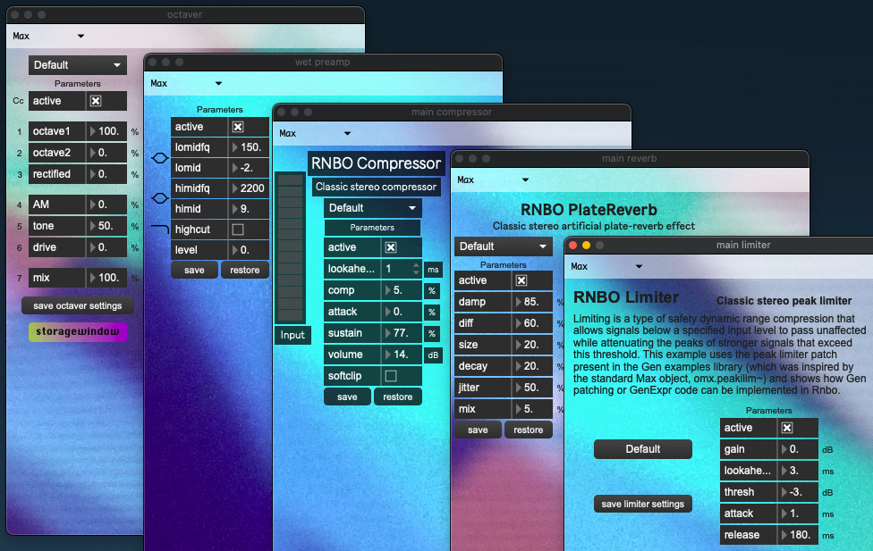
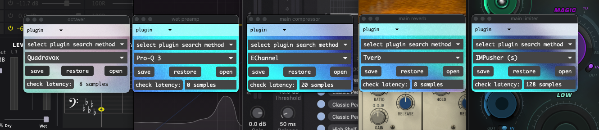
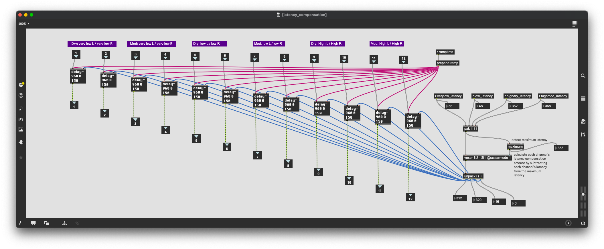

Max or Plugin Selector
======================

Many effects in SousaFX are presented in a way 
that lets you choose between a max-native effect 
or an external audio plugin.

To choose, first turn off the audio engine by clicking the power button in the :ref:`main window <Main Window>`. Then click the effect's main menu to select Max or Plugin, and then turn the audio engine back on. Your choice is auto-saved. 

|

This selector is available for every effect in SousaFX 
except for the following:

- :ref:`LFO <Modulation Parameters>`

- :ref:`Crossfade <Envelope Crossfade>`

- :ref:`Loopers <Loopers>`

- :ref:`Stutter, Tremolo, Filters <Main Stutter Tremolo & Filters>`

- :ref:`Kick Ducker <Kick Ducker>`

- :ref:`FX Banks <FX Banks>` slots 2 - 4.

selectable effects
------------------

-	Sustain EQ

-	Attack EQ

-	Octaver

-	:ref:`Sustain FX <FX Banks>` slot 1

-	:ref:`Attack FX <FX Banks>` slot 1

-	:ref:`Post-crossfade FX <FX Banks>` slot 1

- 	:ref:`Low Pass Filter <Lowpass Filter Selector>`; 
	only plugins supported are 
	`MF-101S <https://software.moogmusic.com/store/mf-101s>`_ and 
	`The Drop <https://cytomic.com/product/drop/>`_.

- 	:ref:`crossover filter <Crossover>`; only plugin supported is ProQ3.

- 	octaver compressor

- 	low crossover compressor

- 	high crossover :ref:`attack compressor <Mix Bus>`

- 	high crossover :ref:`sustain compressor <Mix Bus>`

- 	four :ref:`delay sends <Delay and Reverb Sends>`; 
	also supports external routing.

- 	:ref:`reverb send <Delay and Reverb Sends>`

- 	main reverb

- 	main compressor

- 	main limiter

- 	:ref:`monitor mix EQ <Monitor Mix>`

Latency Compensation
--------------------

Latency compensation is recalculated whenever a plugin loads, or the FX Banks change. If a plugin parameter changes the plugins latency after it loads, then manually recalculate the latency by clicking "check latency".

