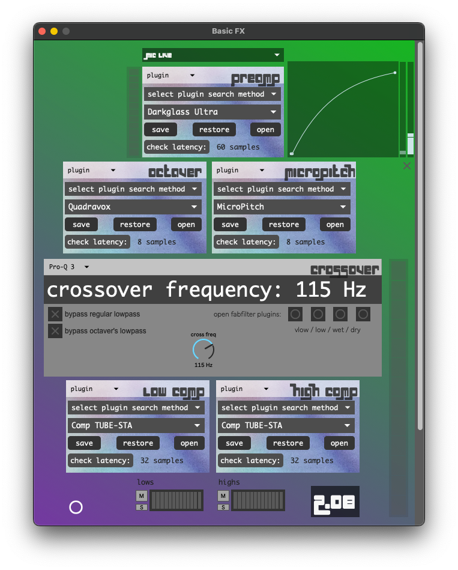

BasicFX
=======

Sometimes I just need SousaVFX with a regular tuba sound, so I made BasicFX. This can be launched instead of SousaFX via the Startup Preferences. It's set up for plugins, and doesn't utilize a game controller or any fancy effects aside from the octaver. Use light compression if the venue's sound person is gonna use more compression.

