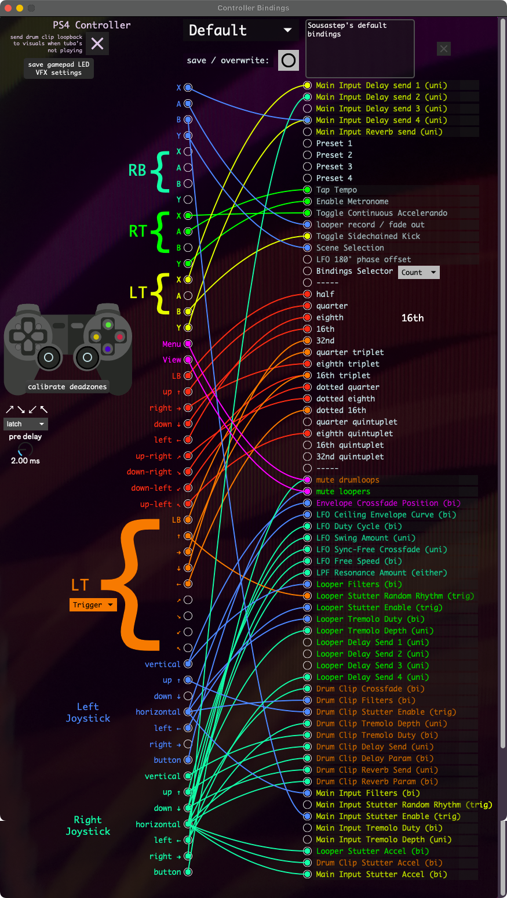

Controller Bindings
===================

.. toctree::
   :maxdepth: 2

   pcl.rst
   deadzones.rst

The controller bindings window uses `max's crosspatch <https://docs.cycling74.com/max8/refpages/crosspatch object>`_ to connect gamepad inputs with effect parameters.

Click parameter lables to open their :ref:`control logic settings <Parameter Control Logic>`.

Click to the right of the parameter lables to open the effect window that they apply to.

