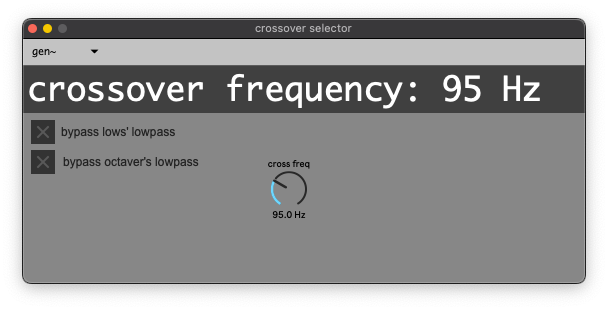
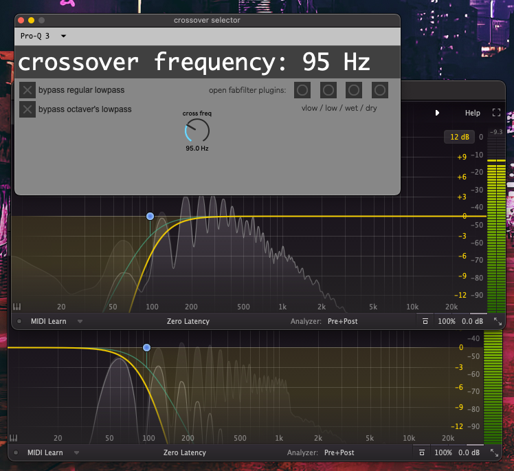

Crossover
=========

Crossover filters separate low frequencies from high frequencies so that they can be effected separately and recombined later. The highs can get distorted, flanged, and wah'd, while the lows are left mostly clean.

There are two kinds of crossovers available in SousaFX, each with two stereo highpass filters for the :ref:`Attack and Sustain FX <FX Banks>`, and two mono lowpass filters for the dry lows and octaver.

One native to Max, thanks to `Timothy Place and lysdexic <https://cycling74.com/tutorials/crossover-filter-design-video-tutorial#reply-5e4377db8a6f416613deaf7c>`_.

And one made with `FabFilter ProQ3 <https://www.youtube.com/watch?v=qrXXNKhjBE8&t=436s>`_, which you can use if you own ProQ3.

