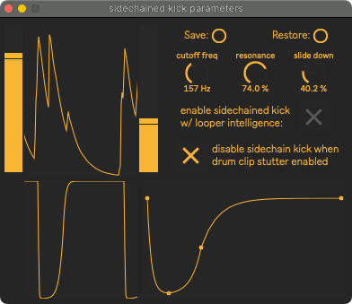

Kick Ducker
===========

This allows the tuba to duck out of the way of the kick drum.

For this to work, :ref:`SousaPlayback's drum bus's <SousaPlayback>` external output 
must be routed to SousaFX's :ref:`"drum tracks L/R" inputs <Audio IO Status>`_.

:enable sidechain kick with looper intelligence:

   The duck affects the loopers, delays & reverb, 
   and main input separately. When this parameter 
   is enabled, all three duckers are enabled, 
   except for the main input's when the 
   looper status is "looping" or "fading out".

   looper status - activated duckers
   
      1. Idle - looper, delays & reverb, main input
   
      2. Prepared - looper, delays & reverb, main input
      
      3. Recording - looper, delays & reverb, main input
      
      4. Looping - looper, delays & reverb
      
      5. Fading Out - looper, delays & reverb

:disable sidechain kick when drum clip stutter enabled:

   I must not've liked how the drum clip stutter sounded with the ducker enabled.

:function:

   Click and drag the points to change the volume envelope shape. clicks create points. shift-click deletes points. option-click-drag curves lines.

:cutoff freq:

   Sets the sidechain signal's lowpass filter's cutoff frequency.

:resonance:

   Sets the sidechain signal's lowpass filter's resonance.

:slide down:

   Sets the sidechain signal's envelope's fall time.

:sliders:

   The left slider sets the point at which the rising envelope will trigger the duck. The duck cannot be triggered again until the falling envelope passes the right slider.

