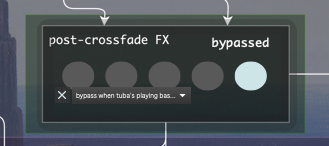
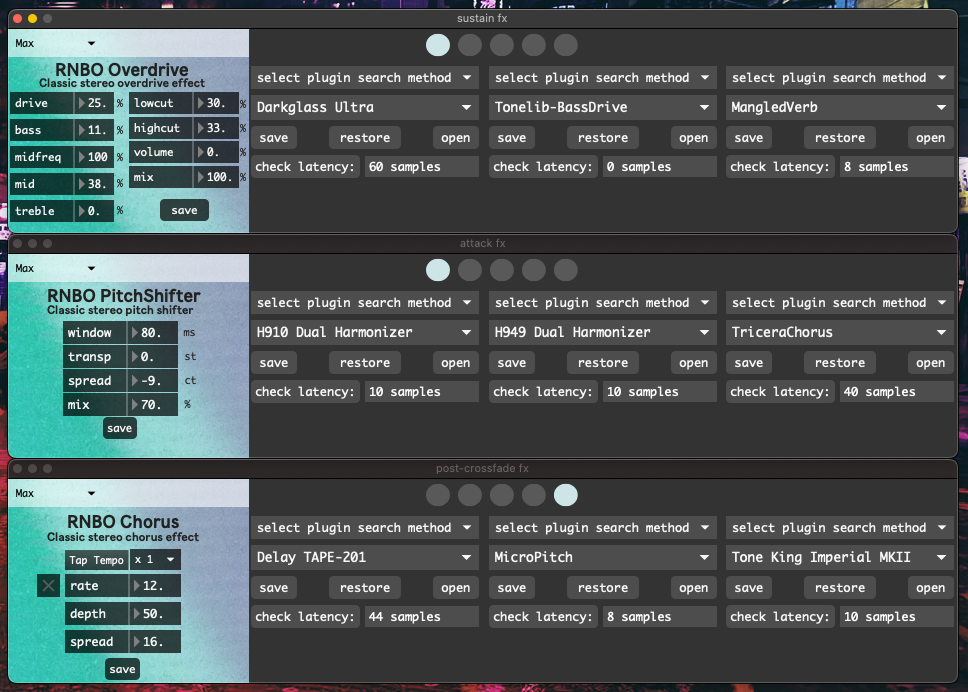

FX Banks
========

There are three FX Banks that run up to four plugins each. The first plugin slot can instead be a Max-native audio effect from the `RNBO Guitar Pedals package <https://rnbo.cycling74.com/explore/rnbo-pedals>`_.

The FX Banks are represented in the main window like so:

|
|

.. image:: media/prexfadebanks.png
   :width: 80%
   :align: center
   :alt: prexfadebanks

The bleed dial allows the Attack FX's output into the Sustain FX's output and vice-versa. A little bit goes a long way.

The first four circles switch between plugins 1 - 4, and the fifth circle bypasses all plugins.

The small menu has three options:

- never bypass

- bypass when tuba's playing bassline

- bypass when tuba's soloing

The toggle has two options:

- off: return to original FX when unbypassing.

- on: randomize FX when unbypassing.

These options, and the current plugin selections, are saved within the Main Presets.

The plugins themselves each have their own separate save-files.

Latency compensation occurs automatically and varies depending on the currently selected plugins' latencies. This ensures the lowest possible latency.