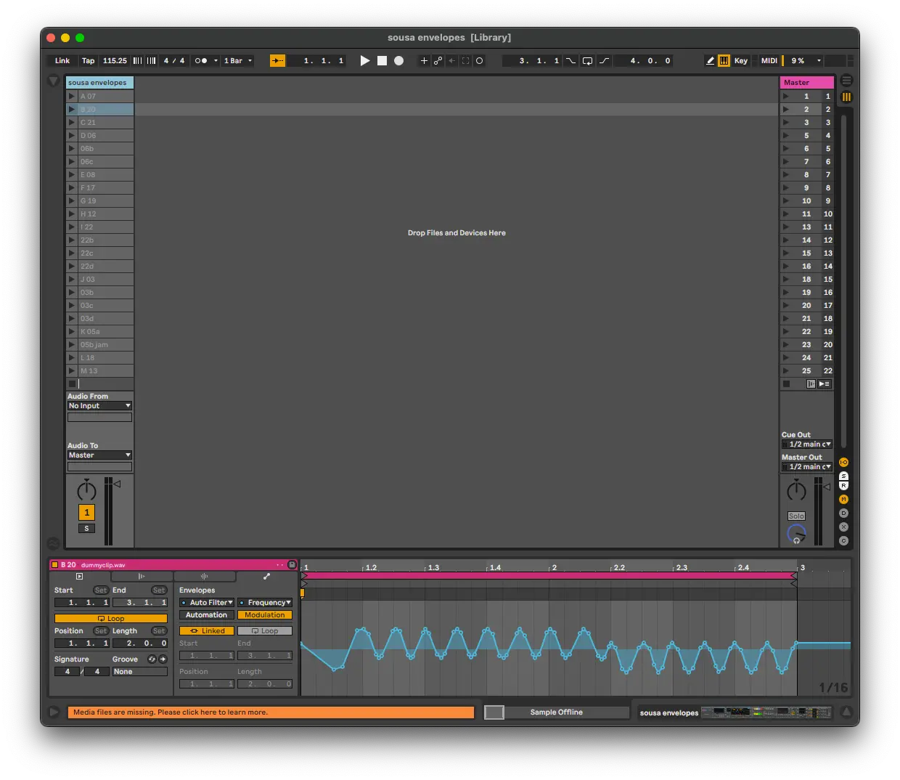
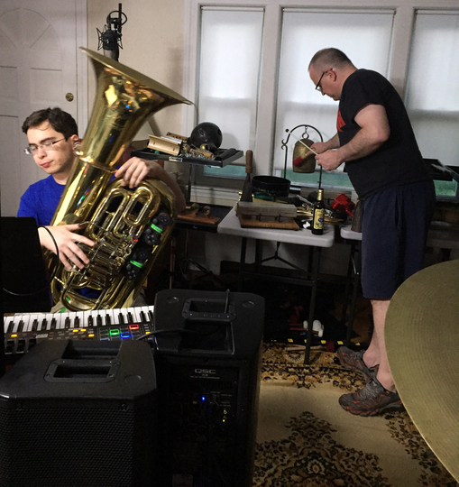
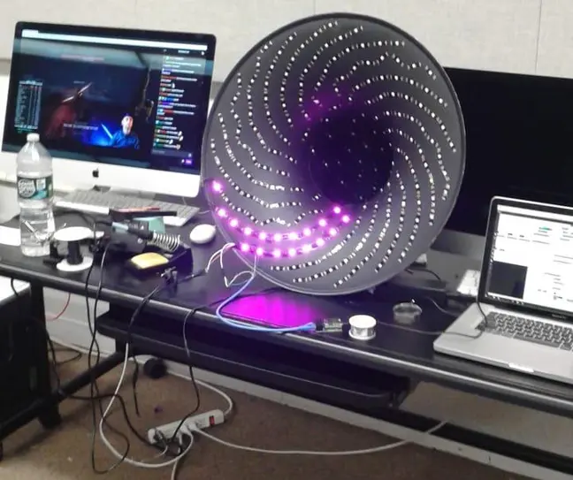
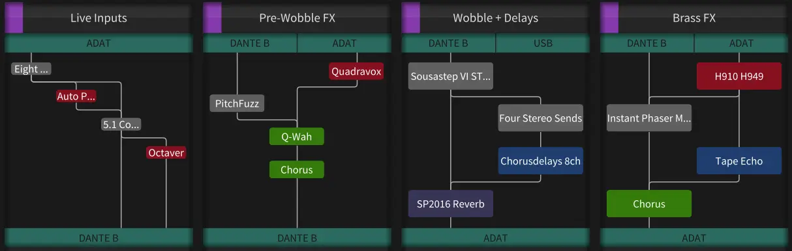
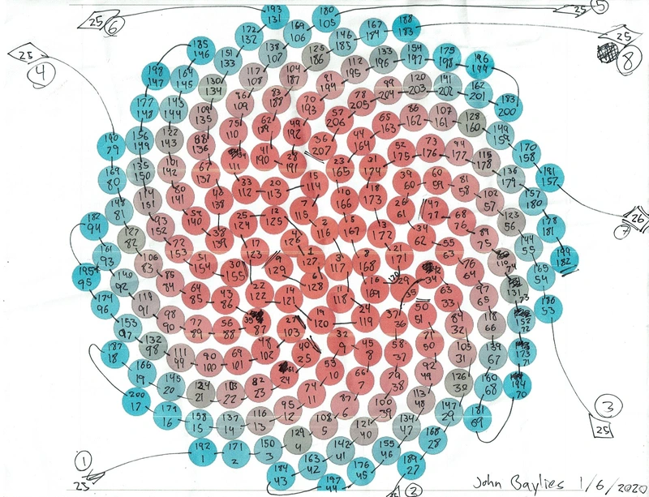

Timeline
========

2014
----

.. figure:: media/9-29-2014.webp
   :align: left
   :alt: 9-29-2014.webp

|

|

2015
----

.. raw:: html
   <iframe width="100%" height="300" scrolling="no" frameborder="no" allow="autoplay" src="https://w.soundcloud.com/player/?url=https%3A//api.soundcloud.com/tracks/196595843&color=%23ff5500&auto_play=false&hide_related=false&show_comments=true&show_user=true&show_reposts=false&show_teaser=true&visual=true"></iframe>
<a href="https://soundcloud.com/jbaylies" title="John Baylies" target="_blank" style="color: #cccccc; text-decoration: none;">John Baylies</a> · <a href="https://soundcloud.com/jbaylies/coki-all-of-a-sudden-sousastep-remix" title="Coki - All of a Sudden // sousastep remix" target="_blank" style="color: #cccccc; text-decoration: none;">Coki - All of a Sudden // sousastep remix</a>

|

.. raw:: html
   <iframe width="560" height="315" src="https://www.youtube.com/embed/O0IExQclhTE?si=VcKWLepvD4dJ8hAy" title="YouTube video player" frameborder="0" allow="accelerometer; autoplay; clipboard-write; encrypted-media; gyroscope; picture-in-picture; web-share" referrerpolicy="strict-origin-when-cross-origin" allowfullscreen></iframe>

|

2016
----

.. raw:: html
   <iframe width="560" height="315" src="https://www.youtube.com/embed/TwzUYv6-nXs?si=Sh15FYIoAyJJ8wba" title="YouTube video player" frameborder="0" allow="accelerometer; autoplay; clipboard-write; encrypted-media; gyroscope; picture-in-picture; web-share" referrerpolicy="strict-origin-when-cross-origin" allowfullscreen></iframe>

|

.. figure:: media/aug-25-2016.webp
   :align: left
   :alt: turbulence doom choir lava flow

   Turbulence Doom Choir: Lava Flow

|

2017
----

   Turbulence Doom Choir: Angular Velocity Vectors

|

.. figure:: media/controllermate.webp
   :align: left
   :alt: controllermate

   Controllermate

|

2018
----

.. figure:: media/june\ 27\ 2018.webp
   :align: left
   :alt: june 27 2018.webp

|
   
2019
----

.. figure:: media/jun\ 27\ 2019.webp
   :align: left
   :alt: jun 27 2019.webp

|

.. figure:: media/dec-13-2019.webp
   :align: left
   :alt: dec-13-2019

|

|

2020
----

.. figure:: media/mar\ 25\ 2020.webp
   :align: left
   :alt: mar 25 2020.webp

|

.. figure:: media/jan\ 14\ 2020.webp
   :align: left
   :alt: jan 14 2020.webp

|

|

|

2022
----

.. figure:: media/aug\ 18\ 2022.webp
   :align: left
   :alt: jan 14 2020.webp

|

2023
----

.. figure:: media/dec\ 16\ 2023.webp
   :align: left
   :alt: dec 16 2023.webp

|
