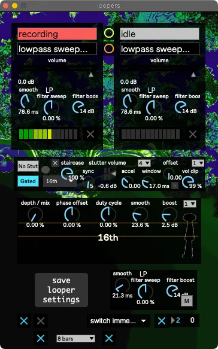

Loopers
=======

A simple "one-button" looper with a handful of effects.

|

The looper has four main states.

   1. Idle

      a. Prepared
   
   2. Recording
   
   3. Looping

      b. Prepared
   
   4. Fading Out

Hitting the button (called ``looper record / fade out`` in the :ref:`bindings <Controller Bindings>`) 
advances the looper state from Idle to Prepared. Playing tuba advances from Prepared to Recording. 
After 8 bars or so, once the tuba's envelope drops below the :ref:`noise gate <Envelope Crossfade>`, the looper automatically stops Recording 
and starts Looping. Hitting the button a second time 
prepares the looper to begin Fading Out when the loop repeats.

Below the two loopers are the post-loop :ref:`Stutter, Tremolo, & Filters <Main Stutter Tremolo & Filters>`. The following :ref:`bindings <Controller Bindings>` are available:

- ``Looper Stutter Enable``

- ``Looper Stutter Accel``

- ``Looper Stutter Random Rhythm``

- ``Looper Filters``

- ``Looper Tremolo Duty``

- ``Looper Tremolo Depth``

- ``loopers tremolo and stutter subdivision``

- ``mute loopers``

.. _risers:

Enabling the toggle on the bottom-left makes Ableton play 
a random riser clip whenever the looper starts fading out.

The toggle to the right of the aformentioned toggle makes the looper auto-record after the tuba drops below the :ref:`noise gate <Envelope Crossfade>` a certain number of times /after/ the looper finishes fading out.

.. _cliptrigger:

The menu on the bottom-right chooses how to trigger drum clips in :ref:`SousaPlayback <SousaPlayback>` after the looper fades out.
