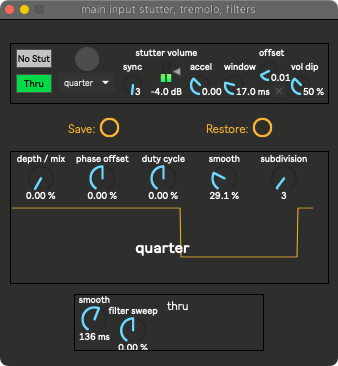

Main Stutter Tremolo & Filters
==============================

Several parameters here are available in the :ref:`bindings <Controller Bindings>`. Both the stutter and tremolo's subdivisions are attached to the binding's subdivision.

Tremolo binds
-------------

- depth/mix: Main Input Tremolo Depth (uni)

   Amount of tremolo.

- duty cycle: Main Input Tremolo Duty (bi)

   The fraction of one period in which the signal is active. 

   .. image:: media/PWM_duty_cycle_with_label.gif
      :width: 20%
      :align: left
      :alt: duty

Filter binds
------------

- filter sweep: Main Input Filters (bi)

   Bypass at 50%. Approaching 100% is a lowpass sweep up, and approaching 0% is a highpass sweep down. The filters are an MS20-like 24 dB/oct `Sallen Key filter <https://en.wikipedia.org/wiki/Sallen%E2%80%93Key_topology>`_ by :ref:`Surreal Machines <SousaFX Max Patches>`.

Stutter Parameters
------------------

:button: 

Main Input Stutter Random Rhythm (trig)

:No Stut:

   Toggle stutter on and off. Bound to "Main Input Stutter Enable (trig)"

:vol dip:

   Determines how much the stutter volume will decrease as the acceleration increases from neutral. Otherwise the accel absolutely shreds.

:offset:

   Positive offset can improve transients at the beginning of the loop by shifting them outside of the declick window.

:window:

   Prevents clicks by quickly muting the stutter at the loop point. Determines how long muting should take.

:accel:

   Slow down and speed up the stutter FX. Bound to "Main Input Stutter Accel (bi)"

:stutter volume:

   it's the volume

:sync:

   same as the subdivision to the left.

:gated or thru:

   Should the input be gated by the stutter, or always pass through regardless of if the stutter is occuring? This is hardcoded to change dynamically based on a few parameters...

