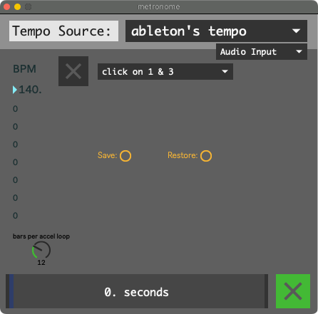

Metronome
=========

Tempo Source
------------

- Tap Tempo: Tempo set by tapping. Metronome resets when unmuted, so be sure to unmute on the downbeat. LFO retriggered by "transient detection", and by unmuting the metronome

   This is best when playing freely, without a click.

- Ableton's Tempo: Tempo, LFO, and Metronome all locked to Ableton Live.

   This is best when playing along with clips in Live.

- Metronome's Tempo When On: When the metronome's muted, the LFO is retriggered by transient detection. When metronome is active, the LFO is locked to the metronome. The metronome resets when unmuted, so be sure to unmute on the downbeat. 

   This is best when playing with folks who can monitor a click. 
   For example: The drummer can improvise a groove at any tempo, 
   and you can tap tempo along. Then you can unmute the metronome 
   on the downbeat, the LFO will lock to the metronome, 
   and the drummer can listen to the click.

- Metronome's tempo always: The metronome is free-running and isn't reset when unmuted. The LFO is locked to the metronome while muted and unmuted.

   tbh i never use this one

Audio Input or Live Link
------------------------

When the Tempo Source is Ableton's Tempo, this setting picks wether Ableton's sync signal comes from the "phasor1n" Max For Live device, or Live Link.

Live Link is simple to set up, but gets offbeat if the tempo changes suddenly.

The "phasor1n" Max For Live device sends a 1-bar-long phasor audio signal out of Live and into Max. It's always in time, but you have to set up the audio route from Live to Max yourself, and you have to be sure to never route this signal to a speaker, or else you'll hear a pop once per bar.

Which Beats
-----------

Pick which beats the metronome should emit a click on.

- click on 1 & 3

- click on 1 2 3 & 4

Continuous Accelerando
----------------------

The continuous accelerando affects the Metronome, Modulation, Loopers, and Drum Clips.

"Bars Per Accel Loop" sets how long it takes for a continuous accelerando to reach its original tempo

When Continuous Accelerando is toggled off, the number of seconds remaining in the accel loop is displayed, and the accel ceases once the original tempo is reached.

My two favorite examples of continuous accelerandos:

 - `Autechre Fold4 Wrap5 <https://www.youtube.com/watch?v=vUioVGqfu6s>`_

 - `Vijay Iyer Historicity <https://www.youtube.com/watch?v=PG6UwES2laU&t=371s>`_
