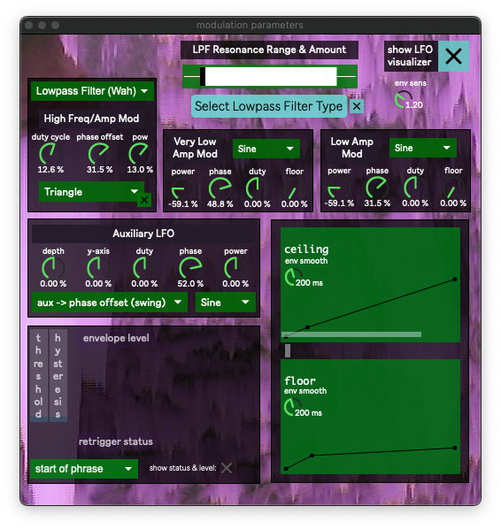
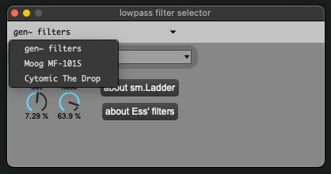
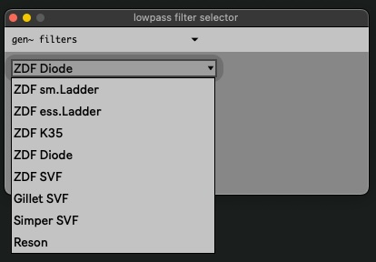

Modulation Parameters
=====================

Several parameters here are available in the :ref:`bindings <Controller Bindings>`. 

   - LFO Ceiling Envelope Curve (bi)
   - LFO Duty Cycle (bi)
   - LFO Swing Amount (uni) [Auxiliary LFO depth]
   - LFO Sync-Free Crossfade (uni) [no user interface]
   - LFO Free Speed (bi) [no user interface]
   - LPF Resonance Amount (either)

The lowpass filter selector switches between a collection of gen~ filters, and optionally, two paid plugins: `Moog MF101S <https://www.moogmusic.com/products/moogerfooger-mf-101-lowpass-filter>`_, and `Cytomic The Drop <https://cytomic.com/product/drop/>`_. This selection is saved independently of the :ref:`main presets <Main Window>`.

The gen~ filter selection, however, is saved with the main presets.

   - ZDF sm.Ladder
   - ZDF ess.Ladder
   - ZDF K35
   - ZDF Diode
   - ZDF SVF
   - Gillet SVF
   - Simper SVF
   - Reson

