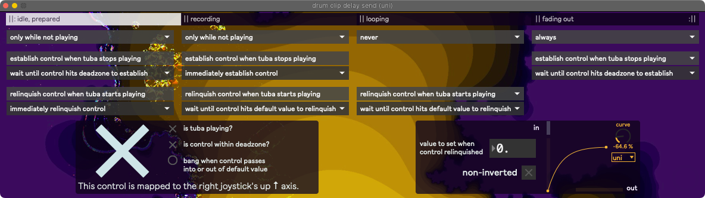

Parameter Control Logic
=======================

Gamepad/parameter mappings can be relinquished and established automatically based on wether or not the tuba's playing. Relinquishing and establishing can either happen immediately when the tuba starts or stops playing, or they can be made to wait until the gamepad's respective joystick axis touches its :ref:`deadzone or default value <Deadzones>`.

There are four sets of settings for relinquishing and establishing control, which correspond to the :ref:`looper status <Loopers>`. 

- Playing bassline, aka before recording a loop.

- Recording bassline / loop.

- Looping bassline while soloing.

- Fading out bassline while soloing.

The control can be inverted, and curved as well.

These settings are saved within the :ref:`controller bindings <Controller Bindings>` presets.

