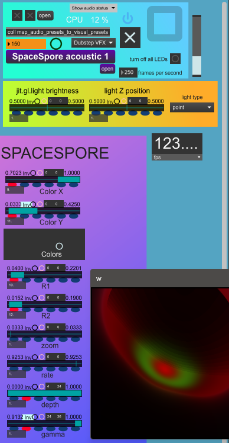
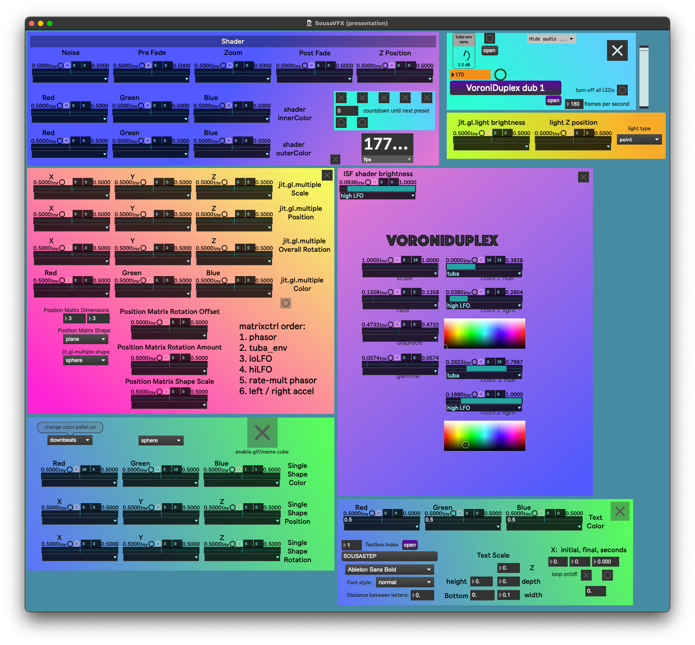
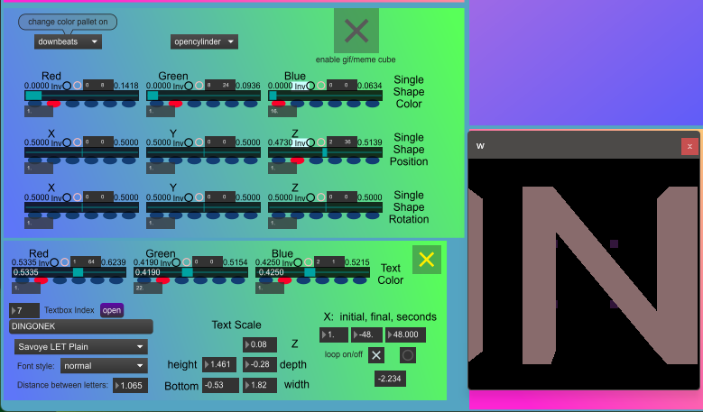
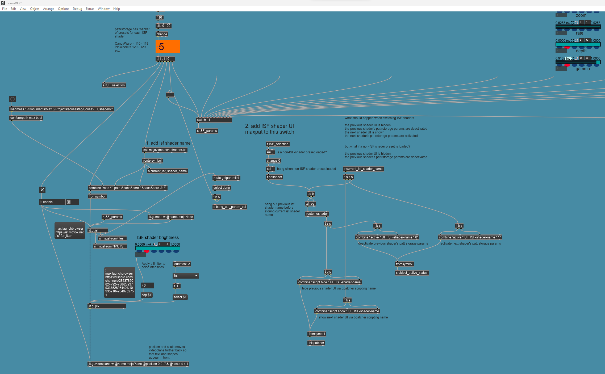
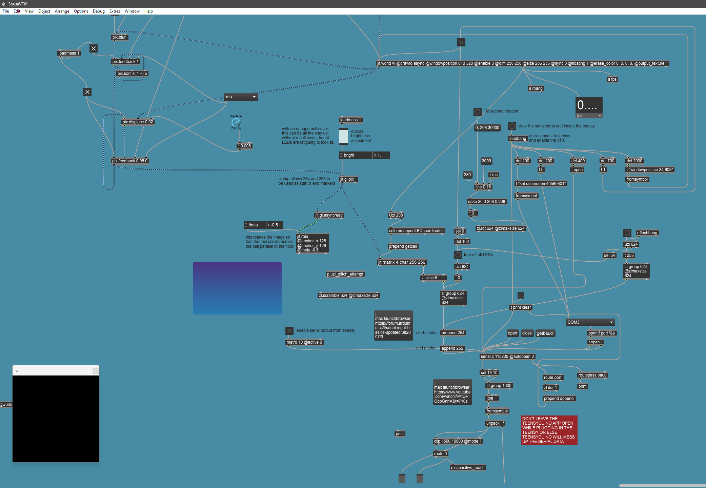

SousaVFX
========

SousaFX integrates with SousaVFX via five 
audio-rate control signals to provide 
visual effects for LED sousaphone bells. 
SousaVFX may run on the same computer 
as SousaFX, or on a separate computer. 
For example, I have SousaFX on my mac, 
and send those five outputs to my RME MADIface 
via USB, then to the Eventide H9000R via MADI, 
then from MADI to Dante thru the H9000R, 
to Dante Via on my windows PC via ethernet, 
to SousaVFX.

.. note::

	Other VFX apps such as `VDMX <https://vidvox.net/>`_, 
	`Resolume <https://resolume.com/>`_, 
	or `Touchdesigner <https://derivative.ca/>`_ 
	would also play nicely with SousaFX's control signals.

   SousaVFX screenshot #1

Startup
-------

1. Open ``~/Documents/​Max 8/​Projects/​sousastep/​SousaVFX/​SousaVFX.maxproj``

2.	If SousaVFX is running on the same computer as SousaFX, 
	then the following :ref:`Audio IO <Audio IO>` may be set to Off.
		
		- Main 1-bar Phasor
		
		- Phasor offset rate
		
		- High Freq Mod Mixed
		
		- Low Amp Mod Mixed
		
		- tuba + timefx env

	If SousaVFX and SousaFX are running on different computers, 
	then SousaFX's aformentioned audio outputs must be routed 
	to SousaVFX's audio inputs of the same name.

Screenshots
-----------

   SousaVFX screenshot #2

   SousaVFX screenshot #3

   patching mode. ISF preset switcher.

   patching mode. Sending RGB data to a Teensy via ``serial``.
