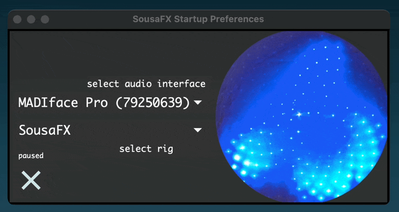
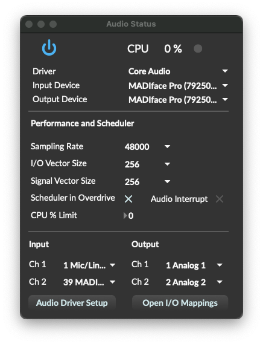

Startup
=======

SousaFX
-------

Steps 2 - 5 are only necessary the first time SousaFX starts.

1. Open ``~/Documents/​Max 8/​Projects/​sousastep/​SousaFX/​SousaFX.maxproj``. You may want to drag this file into your dock for easy access. SousaFX's Startup Preferences window will appear.

2. Click on ``menubar > Settings > Audio Status...`` and set your preferred driver, sample rate, and vector size. 48 kHz and 256 samples are recommended.

3. Close the Audio Status window and select your preferred audio interface in SousaFX's Startup Preferences.

4. Uncheck the Startup Preferences' pause button. :ref:`SousaFX will appear momentarily <Main Window>`. It takes a couple minutes to boot, but while it does, you may ponder a randomly selected prompt from :ref:`"Do It (Home)", or "Prompts for Programmers" <SousaFX Media>`.

5. Open the :ref:`Audio IO <Audio IO Status>` and ensure that the Main and Monitor :ref:`return tracks <Return Track List>` are routed to their proper audio outputs.

From here, you can use SousaFX on its own, or you can run it alongside SousaPlayback.

..
   hide:: The rig choices include SousaFX, which is the main rig, BasicFX, which is just a compressor and distortion effect, and VFX, which you'll only need if you've made an `LED sousaphone bell <https://jbaylies.github.io/Electrobrass_Encyclopedia/en/master/content/tutorials/LED-sousa-bell.html>`_.

SousaPlayback
-------------

Steps 7 - 9 are only necessary the first time SousaPlayback starts.

6. Open ``~/Documents/​Max 8/​Projects/
   ​sousastep/​default/
   ​SousaPlayback template Project/
   ​SousaPlayback template.als``. You may want to drag this file into your dock for easy access.

7. If you followed :ref:`installation step 7 <SousaPlayback>` then the percussion clips will be available, but feel free to delete them all and add your own.

8. Ensure that the Main and Monitor :ref:`return tracks <Return Track List>` are routed to their proper audio outputs.

9. Set SousaFX's :ref:`Tempo Source <Tempo Source>` to "Ableton's Tempo".

10. `Enable Link <https://help.ableton.com/hc/en-us/articles/209072789-Enabling-Link-in-Live>`_ by clicking its button on the far left of Live's control bar.

11. Select the first `scene <https://www.ableton.com/en/manual/session-view/#tracks-and-scenes>`_ and hit enter.

