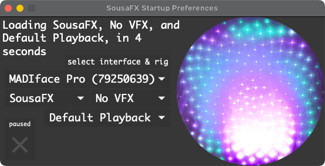
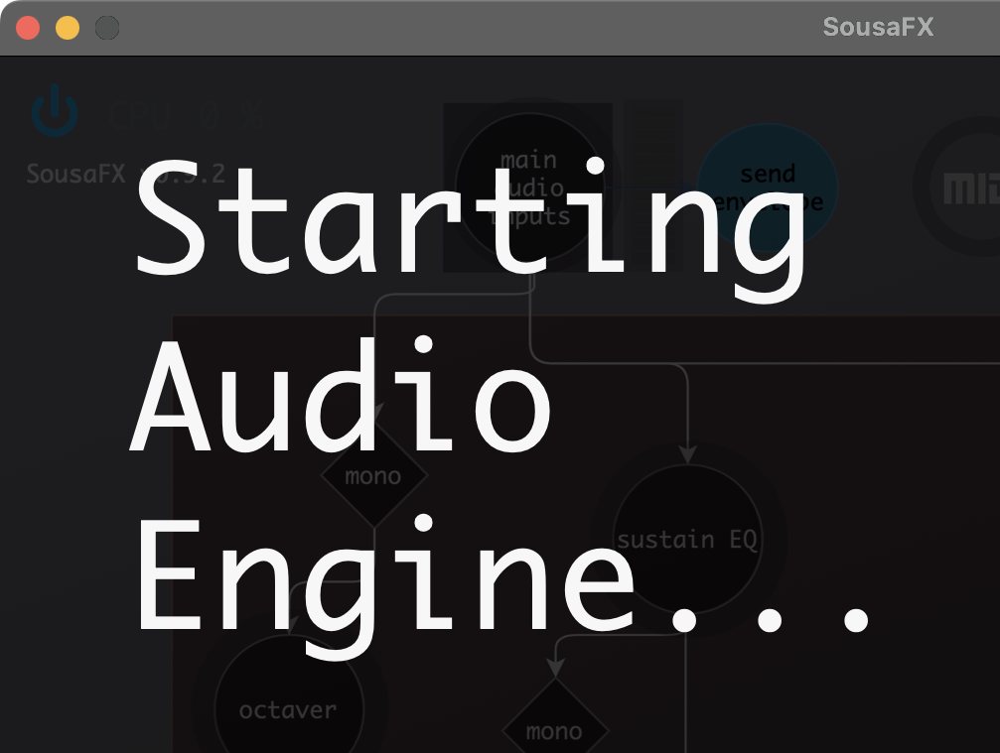
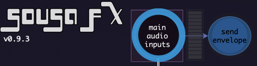

Startup
=======

SousaFX
-------

Steps 2 - 8 are only necessary the first time SousaFX starts.

1. Open ``~/Documents/​Max 8/​Projects/​sousastep/​SousaFX/​SousaFX.maxproj``. SousaFX's Startup Preferences window will appear.

|

2. Open Max's `Audio Status Window <https://docs.cycling74.com/max8/vignettes/audio_status>`_ by clicking on ``menubar > Settings > Audio Status...`` and set your preferred driver, sample rate, and vector size. A sample rate of 48 kHz and a vector size of 256 is recommended. If the audio crackles during use then restart Max and try a vector size of 512.

3. Close Max's Audio Status window and select your preferred audio interface in SousaFX's Startup Preferences.

4. Uncheck the Startup Preferences' pause button. SousaPlayback will appear within a minute, and SousaFX will appear in 2 - 5 minutes. SousaPlayback will automatically start playing the first scene once SousaFX launches.

|

5. Once SousaFX is running, open the :ref:`Audio IO Status window <Audio IO Status>`.

|

6. Set the "live mic" input to your audio interface's microphone input. 

7. If you plan on using headphones, set the "Monitor L & R" outputs to your audio interface's headphone output.

8. If you're using a loudspeaker or amplifier, set the "Main L & R" outputs to your audio interface's main output.

From here, you can do a :ref:`quick soundcheck <Soundcheck>` and start using SousaFX on its own, or you can set up SousaPlayback to utilize drum loops and networked jamming plugins, which is recommended.

SousaPlayback
-------------

Steps 9 - 12 are only necessary the first time SousaPlayback starts.

9. Ensure that the Main and Monitor :ref:`return tracks <Return Track List>` are routed to the audio interface's Main and Headphone/Aux outputs, respectively.

10. If the :ref:`Black Octopus Drum Loops are installed <blackoctopus>` then drum clips will be available in session view, but if they're missing then feel free to delete them and add your own.

11. Set SousaFX's :ref:`Tempo Source <Tempo Source>` to "Ableton's Tempo".

12. `Enable Link <https://help.ableton.com/hc/en-us/articles/209072789-Enabling-Link-in-Live>`_ by clicking its button on the far left of Live's control bar.

