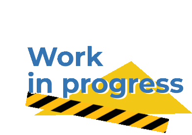

SousaFX Documentation
=====================

Introduction
------------

SousaFX is a multi-effects rig made with `MaxMSP <https://cycling74.com/products/max>`_ that lets you control audio effects using a game controller attached to the side of a tuba. 

It features a number of standard audio effects, thoughtfully refined so that modulating their parameters with a game controller is as musical as possible. A :ref:`controller bindings page <Controller Bindings>` allows you to remap controls and set :ref:`deadzones <Deadzones>`, but to make things more fun, the bindings can also be relinquished and established :ref:`on-the-fly <Parameter Control Logic>`, based on looper status, joystick positioning, and wether or not the tuba's playing.

SousaFX can run either on its own, or alongside Ableton Live to utilize drum loops, backing tracks, networked jamming plugins, etc. A "SousaPlayback template Project" for Live is provided.

SousaFX may be :ref:`downloaded <Installation>` and evaluated for free, however a license must be :ref:`purchased <Purchase>` for continued use.

.. toctree::
   :maxdepth: 3

   content/hardreq.rst
   content/rigpic.rst
   content/install.rst
   content/startup.rst
   content/SousaFX.rst
   content/playback.rst
   content/purchase.rst
   content/attrib.rst
