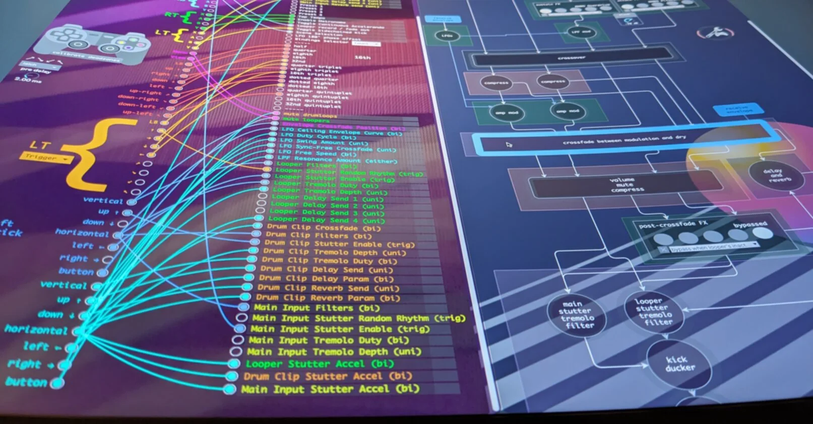
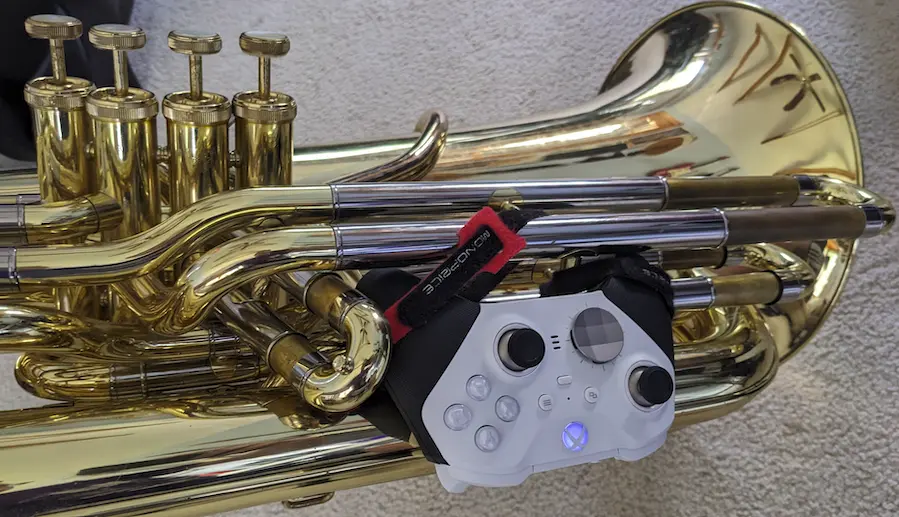
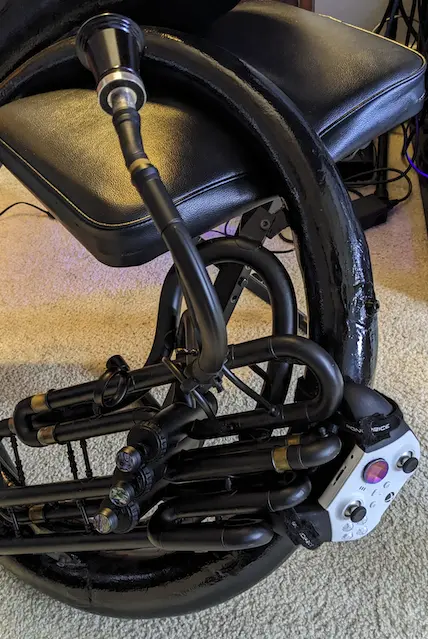

SousaFX Documentation
=====================

.. raw:: html

   <iframe width="100%" height="315" src="https://www.youtube.com/embed/NdwLBfzcsgw?si=VqjZhTUza9QnscP4" title="YouTube video player" frameborder="0" allow="accelerometer; autoplay; clipboard-write; encrypted-media; gyroscope; picture-in-picture; web-share" referrerpolicy="strict-origin-when-cross-origin" allowfullscreen></iframe>

|

Introduction
------------

SousaFX is a multi-effects rig made by `John Baylies <https://www.sousastep.quest/links/>`_ with `MaxMSP <https://cycling74.com/products/max>`_, which lets tuba players control audio and visual effects using a game controller attached to the side of the tuba. 

|

SousaFX can run either on its own, or alongside Ableton Live to utilize drum loops, backing tracks, networked jamming plugins, etc. A :ref:`SousaPlayback template Project <SousaPlaybackTemplate>` for Live is provided.

SousaFX may be :ref:`downloaded <Installation>` and evaluated for free, however a license must be :ref:`purchased <Purchase>` for continued use.

.. toctree::
   :maxdepth: 3

   content/SousaFX.rst
   content/playback.rst
   content/sousavfx.rst
   content/hardreq.rst
   content/install.rst
   content/soundcheck.rst
   content/purchase.rst
   content/releasenotes.rst
   content/mailinglist.rst
   content/attrib.rst

